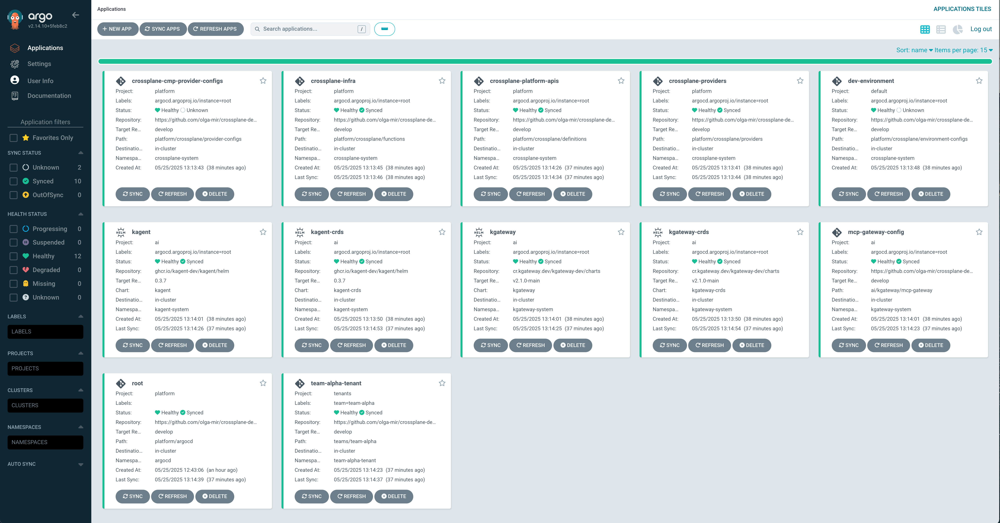

# My Playground

A monorepo containing experimental mini-demos showcasing modern cloud-native and AI-powered workflows. Built on Crossplane for platform API abstractions and infrastructure orchestration, with GitOps practices for deployment automation.
It includes cutting-edge AI projects such as `kgateway` and `kagent` - emerging Kubernetes-native projects designed to enable agentic AI workflows within cloud infrastructure.
This repository serves as a playground for exploring the intersection of infrastructure-as-code, AI agents, and Kubernetes-native tooling.

## Infrastructure

The project's infrastructure consists of 2+ clusters:

1. **Management Cluster**: Infrastructure management and provisioning, running Crossplane and ArgoCD with ApplicationSet controller
2. **Apps Cluster**: One or more clusters for application workload hosting, running ArgoCD

This is deployed using scripts and Crossplane running in local `kind` cluster and is described in [./infra-setup](./infra-setup/), this is not part of the demo.

## Repository Structure

```
├── ai          # AI tenancy, manifests required to create resources in AI space
├── infra-setup # scripts to setup GKE mgtm and apps clusters (not part of demo)
├── platform    # gitops manifests to deploy Crossplane, and other components that are managed by platform team
└── teams       # Software Engineering teams Crossplane tenancy
```

### Platform Building Blocks

#### argocd-foundations

These are foundational objects to configure ArgoCD and umbrella ApplicationSets that include all apps managed in this repo.

Because they are the base for Argo itself, files in this folder are applied externally not by Argo.

```
platform/argocd-foundations/
├── argo-projects.yaml                 # Definitions for all ArgoCD Projects
├── platform-applicationsets.yaml      # ApplicationSet for all apps managed in this repo
├── helm-applicationsets.yaml          # ApplicationSet for all apps installed as external helm
└── teams-applicationsets.yaml         # Teams discovery
```


```
├── platform
│   ├── argocd                   # ArgoCD applications, anything that is installed in the cluster, installed by GitOps.
│   │   ├── crossplane-apis
│   │   ├── crossplane-infra
│   │   ├── crossplane-tenants
│   │   └── mcp-gateway
│   └── crossplane                # Everything required to run Crossplane, including platform abstractions built by platform to be consumed by developer teams
│       ├── compositions
│       ├── definitions
│       ├── environment-configs
│       ├── functions
│       ├── provider-configs
│       └── providers
```


Argo:


