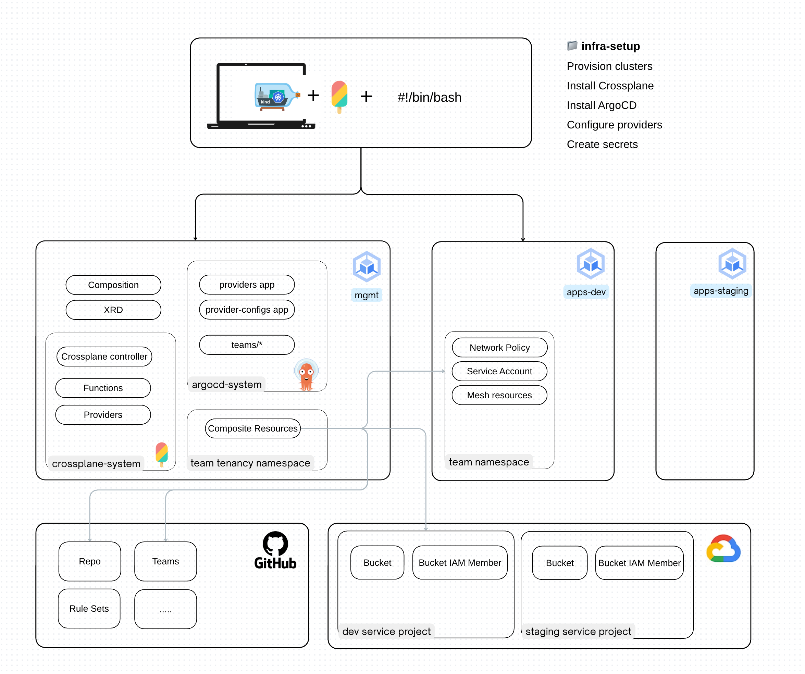

# Welcome

A monorepo containing experimental mini-demos showcasing modern cloud-native and AI-powered workflows. Built on Crossplane for platform API abstractions and infrastructure orchestration, with GitOps practices for deployment automation.
It includes cutting-edge AI projects such as `kgateway` and `kagent` - emerging Kubernetes-native projects designed to enable agentic AI workflows within cloud infrastructure.
This repository serves as a playground for exploring the intersection of infrastructure-as-code, AI agents, and Kubernetes-native tooling.

# Tech Stack

| Logo | Name | Description |
|------|------|-------------|
|  | GKE | Google Kubernetes Engine is Google Cloud's managed Kubernetes service that provides a secure, scalable environment for running containerized applications. |
|  | Gateway API | Kubernetes Gateway API is a collection of resources that model service networking in Kubernetes, providing expressive, extensible, and role-oriented interfaces. |
|  | Crossplane | An open source Kubernetes add-on that transforms your cluster into a universal control plane, enabling platform teams to build infrastructure abstractions. |
|  | kagent | Kubernetes-native AI agent framework that enables the deployment and management of AI agents within Kubernetes clusters. |
|  | kgateway | Kubernetes gateway for AI services, providing a standardized way to connect applications with AI capabilities within the cluster. |
|  | ArgoCD | GitOps continuous delivery tool for Kubernetes that automates the deployment of applications and manages their lifecycle based on Git repositories. |

# Demos

"Demo" is a end-to-end installation or implementation of an idea. It is similar to a tutorial in concept but geared more towards explaning how things work, showing logs, snippets, commands, screenshots, etc.

* [demo/02-argocd](./docs/demo/02-argocd) - Misadventures of a FluxCD soul in ArgoCD wonderland. A demo of how NOT to do Argo
* [demo/06-kagent](./docs/demo/06-kagent) - [kagent](https://kagent.dev/), [github repo](https://github.com/kagent-dev/kagent)
* [demo/10-crossplane](./docs/demo/10-crossplane) - Crossplane.
* [demo/13-gke-gateway-api](./docs/demo/13-gke-gateway-api) - Gateway API as implemented by GKE, exposing Argo using Gateway API.
* [demo/14-kgateway](./docs/demo/14-kgateway) - kgateway.
* [demo/18-crossplane-github](./docs/demo/18-crossplane-github) - Github config managed by Crossplane.

# Infrastructure

This project consists of 2 or more GKE clusters:

1. **Management Cluster**: Infrastructure management and provisioning, running Crossplane and ArgoCD with ApplicationSet controller
2. **Apps Cluster(s)**: One or more clusters for application workload hosting, running ArgoCD

These clusters are deployed via Crossplane running in local `kind`, the setup is described in [./infra-setup](./infra-setup/).
It is also implements credentials for all the components the real clusters. It is far from ideal and is not part of the demo and currently no plans to refactor.

-

# Deployment

Source required environment variables (explained in [infra-setup](./infra-setup/) and run task to provision both clusters with all components configured, up and running.
```
$ task setup:auto-deploy
```

Everything should be running, all manifests applied by Argo, resources provisioned by Crossplane once the above task finishes.

Open ArgoCD console
```
$ task get-argocd-secret
$ task port-forward-argocd
```

Uninstall everything:
```
$ task setup:full-cleanup
```

List all available tasks
```
$ task --list
```

# Repository Structure

This repository hosts both platform teams and consumer teams configurations. Typically they are spread across multiple repos.
Despite being hosted here in one repo for the demonstration purposes, these platform vs development teams sepration of concerns is still maintained.

## Platform Building Blocks

These are foundational objects to configure ArgoCD and umbrella ApplicationSets that include all apps managed in this repo. More on this in [./docs/demo/01-argocd.md](./docs/demo/01-argocd.md)
Because they are the base for Argo itself, files in this folder are applied during cluster provisioning by scripts in [./infra-setup](./infra-setup/)

```
platform/argocd-foundations/
├── argo-projects.yaml                 # Definitions for all ArgoCD Projects
├── platform-applicationsets.yaml      # ApplicationSet for all apps managed in this repo
├── helm-applicationsets.yaml          # ApplicationSet for all apps installed as external helm
└── teams-applicationsets.yaml         # Teams discovery
```

applicationsets files are ArgoCD `ApplicationSets` That generate applications from config provided in:
I don't think this is great approach, I'm still finding my feet in Argo-land and it is not my primary focus (but oh boy did argo quirkiness take so much of my time!)
`cmp` in the filename is important - it will tell ApplicationSet to run these through ArgoCD CMP mechnism to substitute variables

```
platform/config
├── applications
│   ├── crossplane-infra-environment-configs-cmp.yaml
│   ├── crossplane-infra-functions.yaml
│   ├── ....
│   ├── kagent-helm-workaround.yaml
│   └── mcp-gateway-config.yaml
├── helm-applications
│   ├── ...
│   └── kgateway-crds.yaml
└── repository.yaml
```

## Consumers

All folders at the repo root which are not aux, are payloads that are managed by platform users.

```
├── ai          # AI tenancy, manifests required to create resources in AI space (kagent, kgateway, etc)
└── teams       # Software Engineering teams Crossplane tenancy
```

## Connect MCP Servers

```
% task --list
```

More details to be updated soon
