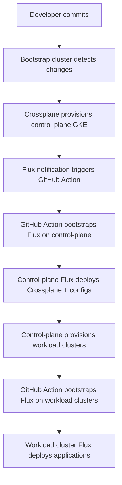

# Cluster Provisioning Specification

## Overview
This document defines the specification and acceptance criteria for automated cluster provisioning in our multi-cluster Kubernetes platform.

## Architecture Requirements

### Core Principles
- **Separation of Concerns**: Infrastructure provisioning vs application deployment
- **GitOps-First**: All changes via git commits, not direct kubectl
- **Hierarchical Control**: Bootstrap → Control Plane → Workload Clusters
- **Zero Circular Dependencies**: Clean dependency chain prevents deadlocks

### Cluster Roles

#### 1. Bootstrap Cluster (kind)
**Purpose**: Temporary local cluster for initial GCP infrastructure provisioning
- **Lifecycle**: Created/destroyed per session
- **Responsibilities**:
  - Provision control-plane cluster only
  - Install Crossplane with GCP providers
  - Trigger control-plane cluster bootstrapping via GitHub Actions
- **Constraints**:
  - Must NOT provision workload clusters directly
  - Should be destroyed after control-plane is operational

#### 2. Control Plane Cluster (GKE)
**Purpose**: Central management cluster for platform services and workload cluster provisioning
- **Lifecycle**: Persistent across sessions
- **Responsibilities**:
  - Host Crossplane with all provider types
  - Provision and manage workload clusters
  - Run platform services (monitoring, security, etc.)
  - GitOps orchestration for workload clusters
- **Constraints**:
  - Must NOT run tenant applications
  - All workload cluster composites managed here

#### 3. Workload Clusters (GKE)
**Purpose**: Isolated clusters for tenant applications
- **Lifecycle**: Persistent, managed by control-plane
- **Responsibilities**:
  - Run tenant applications only
  - Receive platform services via GitOps
  - Local Flux for application deployment
- **Constraints**:
  - Must NOT have Crossplane installed
  - Must NOT manage infrastructure composites
  - No direct infrastructure provisioning capabilities

## Crossplane Compositions

### Control Plane Cluster Composition

```yaml
apiVersion: platform.tornado-demo.io/v1alpha1
kind: GKECluster
metadata:
  name: control-plane-cluster
  namespace: gkecluster-control-plane
spec:
  compositionRef:
    name: control-plane-composition
  parameters:
    clusterName: "${GKE_CONTROL_PLANE_CLUSTER}"
    clusterType: control-plane
    projectId: "${PROJECT_ID}"
    region: "${REGION}"
    zone: "${ZONE}"
    vpcName: "${GKE_VPC}"
    subnetName: "${CONTROL_PLANE_SUBNET_NAME}"
    machineType: "e2-standard-4"
    minNodes: 2
    maxNodes: 5
```

## GitOps Bootstrap Flow



## Directory Structure Requirements

```
├── bootstrap/                     # Bootstrap cluster configs
│   ├── kind/                     # Kind cluster + Crossplane for control-plane
│   └── scripts/                  # Setup/cleanup automation
├── clusters/                     # Target cluster GitOps configs
│   ├── control-plane/           # Control-plane cluster bootstrap
│   │   ├── crossplane-install.yaml
│   │   ├── crossplane-source.yaml
│   │   └── flux-system/
│   └── apps-dev/                # Workload cluster bootstrap
│       ├── platform-services.yaml
│       └── flux-system/
├── control-plane-crossplane/    # Crossplane configs for control-plane
│   ├── compositions/            # Workload cluster compositions
│   ├── providers/              # Provider installations
│   └── workload-clusters/      # Workload cluster definitions
└── platform-tenants/           # Application deployments
    └── apps-dev/               # Apps for apps-dev cluster
```

# Acceptance Criteria

## Infrastructure Validation
- [ ] Bootstrap cluster provisions control-plane cluster successfully
- [ ] Control-plane cluster provisions workload clusters successfully
- [ ] All Crossplane composite resources reach "Ready" state
- [ ] All Flux components reach "Applied" status
- [ ] GitHub Actions trigger correctly from Flux notifications

## Architectural Constraints
- [ ] Bootstrap cluster manages ONLY control-plane provisioning
- [ ] Control-plane cluster manages ONLY workload cluster provisioning
- [ ] Workload clusters have NO Crossplane installation
- [ ] Workload clusters have NO infrastructure management capabilities
- [ ] Control-plane cluster runs NO tenant applications

## Security & Isolation
- [ ] Workload clusters use separate service accounts
- [ ] Network isolation between workload clusters
- [ ] No cross-cluster application access without explicit configuration
- [ ] All secrets managed via Kubernetes secrets or external secret management

## GitOps Requirements
- [ ] All infrastructure changes via git commits
- [ ] No manual kubectl changes to infrastructure
- [ ] Flux reconciliation succeeds within 5 minutes
- [ ] GitHub Actions complete within 10 minutes
- [ ] Failed deployments automatically revert

# Validation Commands

Quick Validation:

```bash
task validate:all
```

Detailed Validation:
```bash
# Check individual clusters
task validate:bootstrap
task validate:control-plane
task validate:workload-clusters

# Verify architectural constraints
task validate:architecture
```

### Expected Output Format
```
🔍 Validating bootstrap cluster...
📦 Flux Components:        [READY/APPLIED status]
🏗️  Composite Resources:    [TRUE/FALSE status]
🚫 Workload composites:     [None - correct]

✅ Bootstrap: PASS
✅ Control-plane: PASS
✅ Apps-dev: PASS
✅ Architecture: PASS
```

## Troubleshooting

### Common Issues
1. **Composite resources stuck in False state**
   - Check Crossplane function logs
   - Verify required annotations on templates
   - Check provider configurations

2. **GitHub Actions not triggering**
   - Verify Flux notification provider configuration
   - Check GitHub webhook token secret
   - Ensure workflow is on main branch

3. **Workload cluster inaccessible**
   - Check GKE cluster status in GCP Console
   - Verify network configuration
   - Check kubectl contexts and credentials

### Debug Commands
```bash
# Check composite resource status
kubectl describe composite <cluster-name>

# Check Crossplane function logs
kubectl logs -n crossplane-system -l app=crossplane

# Check Flux notifications
kubectl logs -n flux-system -l app=notification-controller

# Force Flux reconciliation
kubectl annotate kustomization <name> -n flux-system \
  reconcile.fluxcd.io/requestedAt=$(date '+%Y-%m-%dT%H:%M:%S%z') --overwrite
```

## Success Metrics

### Performance Targets
- **Control-plane provisioning**: < 15 minutes
- **Workload cluster provisioning**: < 10 minutes
- **Application deployment**: < 5 minutes
- **Full stack deployment**: < 30 minutes end-to-end

### Reliability Targets
- **Provisioning success rate**: > 95%
- **GitOps reconciliation success**: > 99%
- **GitHub Action success rate**: > 98%

## Future Enhancements

### Phase 2
- [ ] Multi-region cluster support
- [ ] Automated cluster scaling based on workload
- [ ] Cross-cluster service mesh
- [ ] Advanced monitoring and alerting

### Phase 3
- [ ] Multi-cloud support (AWS, Azure)
- [ ] Advanced security policies
- [ ] Cost optimization automation
- [ ] Disaster recovery automation
