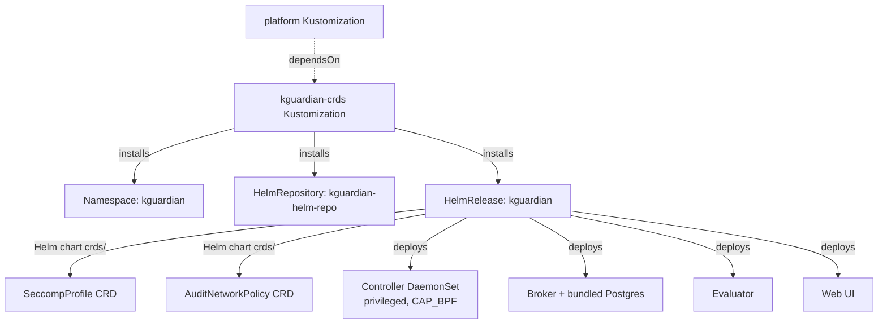

# Design: kguardian-apps-dev

## Approach
Follow the repo's existing "single-HelmRelease, chart-owns-its-CRDs" pattern — the same one LitmusChaos uses — rather than kagent's split pattern (separate CRD-only HelmRelease). kguardian's chart ships `SeccompProfile` and `AuditNetworkPolicy` as a standard Helm `crds/` directory, which Helm installs automatically on first `helm install`, exactly like litmus's `ChaosEngine` CRDs. That means kguardian needs no dedicated CRD-only manifest — one `HelmRelease` covers namespace creation, CRD installation, and the Controller/Broker/Postgres/Evaluator/Frontend deployment in one reconciliation.

The "`*-crds`" Flux `Kustomization` naming convention in this repo is really about *reconciliation ordering*, not a literal CRD-only manifest — litmus's `litmus-crds.yaml` Kustomization points at the entire `litmus/helm/` directory (namespace + `HelmRepository` + `HelmRelease`). kguardian follows the same shape.

## Architecture

```
kubernetes/clusters/apps-dev/
  kguardian-crds.yaml          # Flux Kustomization, path → namespaces/base/kguardian/helm
  platform.yaml                # add "kguardian-crds" to dependsOn (existing file, one-line diff)

kubernetes/namespaces/base/kguardian/
  helm/
    kustomization.yaml         # resources: namespace.yaml, kguardian-helm-repo.yaml, kguardian-release.yaml
    namespace.yaml              # kind: Namespace, name: kguardian
    kguardian-helm-repo.yaml    # HelmRepository, type: oci, url: oci://ghcr.io/kguardian-dev/charts/kguardian
    kguardian-release.yaml      # HelmRelease, chart: kguardian, values below
```

No entry is added to `kubernetes/namespaces/overlays/apps-dev/kustomization.yaml` in this iteration — that file only lists directories carrying *tool-specific CRs* layered on top of an already-installed controller (litmus's `experiments/`, kagent's `kagent/config/`). Since generating-but-not-applying policy YAML is explicitly out of scope for this change, `namespaces/base/kguardian/` has no such sibling directory yet. The `kguardian-crds` Kustomization is standalone and sufficient; `platform.yaml`'s `dependsOn` only needs to gate on it if/when a future change adds kguardian CRs (e.g. checked-in `AuditNetworkPolicy` resources) to the overlay.



## Key Decisions

### Decision: Bundled Postgres vs. new CloudNativePG/Cloud SQL pattern
- **Options considered:** (a) chart's bundled Postgres subchart, (b) install CloudNativePG cluster-wide via a new HelmRelease, (c) new Crossplane composition for Cloud SQL (analogous to the existing `cloudrun` composition).
- **Chosen:** (a), `database.enabled: true` (chart default), no `storageClassName` override.
- **Rationale:** (b) and (c) both introduce a brand-new infrastructure pattern to the repo for a single tool's benefit, which is disproportionate on a disposable, per-session cluster. GKE Standard's default `standard-rwo` StorageClass satisfies the bundled subchart's PVC with zero extra manifests. Revisit only if a second tool later needs Postgres.

### Decision: OCI HelmRepository vs. HTTP HelmRepository
- **Options considered:** litmus's HTTP `HelmRepository` (`https://litmuschaos.github.io/litmus-helm/`), kagent's OCI `HelmRepository` (`type: oci`, `url: oci://ghcr.io/...`).
- **Chosen:** OCI, matching kagent.
- **Rationale:** kguardian's README quick-start installs directly from `oci://ghcr.io/kguardian-dev/charts/kguardian` — there is no HTTP Helm index published, so OCI is the only option, not a style choice.

### Decision: CiliumNetworkPolicy as the primary generation target
- **Options considered:** plain `NetworkPolicy` only, `CiliumNetworkPolicy` only, both.
- **Chosen:** default to `NetworkPolicy` generation (the CLI's own default), document `--type cilium` as the recommended flag given Dataplane V2 is already active — not baked into any chart value, since policy *generation* happens via the `kubectl kguardian` CLI at operator discretion, not via HelmRelease config.
- **Rationale:** Dataplane V2 already enforces plain `NetworkPolicy` natively, so both types work; `CiliumNetworkPolicy` is worth calling out in docs/tasks as the more expressive option (L3-L7, FQDN rules) but isn't a chart-level setting to decide up front.

### Decision: Telemetry and AI Assistant left off
- **Options considered:** leave chart defaults (telemetry on, AI assistant off), explicitly disable telemetry, enable AI assistant with a new Anthropic key secret.
- **Chosen:** explicitly set `telemetry.enabled: false`; leave `ai.enabled` at its default `false`.
- **Rationale:** matches the project's security-aware defaults (no unnecessary outbound calls) and keeps this change from needing a new secret — see [Secrets and Keys](../../../AGENTS.md) distinction between `ANTHROPIC_API_KEY` and `KAGENT_ANTHROPIC_API_KEY`; a third kguardian-specific key would need its own careful naming if ever added.

## Implementation Notes
- **Chart version pin:** `charts/kguardian` was at `1.23.1` at research time — pin the actual `version:` field in `kguardian-release.yaml` to whatever is current at implementation time (check `oci://ghcr.io/kguardian-dev/charts/kguardian` tags). Once pinned with a plain `version:` field (matching the kagent/litmus convention), the repo's existing `scan-versions.sh` weekly automation (`docs/upgrade-versions.md`) picks it up automatically — no separate registration step needed, but worth confirming after the first scan run since it's an OCI source (the doc's only documented quirk so far is litmus's HTTP-index case, not OCI).
- **Kernel floor is unverified until the cluster exists:** the Crossplane GKE composition (`kubernetes/components/crossplane-compositions/base/gke-cluster/gke-cluster-composition.yaml`) doesn't pin `imageType`, so nodes default to COS_CONTAINERD on the `RAPID` channel. Confirm kernel ≥ 6.2 with `kubectl --context <apps-dev-context> get nodes -o wide` right after `task setup:deploy`, before assuming the Controller DaemonSet will schedule successfully. If it doesn't meet the floor, the fix is pinning `imageType: COS_CONTAINERD` (or a newer node pool) in the composition — a separate, small follow-up.
- **`HelmRelease` shape:** mirror `litmus-release.yaml`'s `install.remediation.retries: 3` / `upgrade.remediation.retries: 3` convention; add `install.timeout` / `upgrade.timeout` (kagent uses `15m`) since kguardian's bundled Postgres + multiple Deployments is a heavier install than litmus's core chart.
- **Values to set explicitly:** `telemetry.enabled: false`; leave `database.enabled`, `ai.enabled`, `controller.resources`, `broker.resources` at chart defaults for the initial install — right-size only if the fleet health check flags pressure.
- **`postBuild.substituteFrom`:** the new `kguardian-crds.yaml` Kustomization should include the same `platform-config` ConfigMap substitution block as `kagent-crds.yaml`/`litmus-crds.yaml`, even though this iteration's values don't currently reference any substituted variable — kept for consistency with the other `*-crds` manifests in `kubernetes/clusters/apps-dev/`.

## Testing Strategy
- `task validate:kustomize-build` — confirms the new `namespaces/base/kguardian/helm/` kustomization and the updated `namespaces/overlays/apps-dev` tree (if later extended) build cleanly.
- Validate the new `kguardian-crds.yaml` Kustomization and the `platform.yaml` diff with `yq` per the project's Taskfile-validation rule before committing.
- After `task setup:deploy` provisions the fleet: watch `flux get kustomizations --context <apps-dev-context>` for `kguardian-crds` to report `Ready`, then `flux get helmreleases -n kguardian --context <apps-dev-context>` for the `kguardian` release.
- `scripts/check-fleet-health.sh` — run after install to confirm the new namespace/workloads don't regress overall fleet health.
- Functional smoke test: port-forward or exec `kubectl kguardian` (installed via the client-side `quick-install.sh`, out of manifest scope) against a `team-alpha` pod, confirm a `NetworkPolicy` (and optionally `--type cilium`) generates from real observed traffic, and confirm a `SeccompProfile` generates in audit mode — validating specs/apps-dev-workloads.md scenarios end-to-end.
- Confirm no telemetry egress: check Broker logs / values for `telemetry.enabled: false` taking effect (no daily check-in request).
